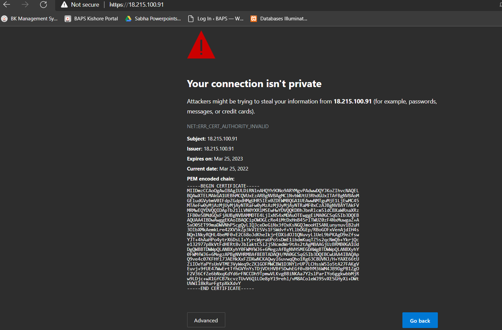

# Project 3
## Ashu Patel

## Part 1 - Set Up HTTP

- what service you installed & how
  - Apache2
```
sudo apt install apache2
```
- what port it serves content over
  - 80
- where site content exists
  - /var/www/html/
- any special configurations you did
  - No
- changed permissions?
  - No
- changed default locations for where content is served?
  - No
- 

## Part 2 - Get Certified

- How to generate a certificate
```
sudo openssl req -x509 -nodes -days 365 -newkey rsa:2048 -keyout /etc/ssl/private/apache-selfsigned.key -out /etc/ssl/certs/apache-selfsigned.crt
```
- Location for certs on system
```
/etc/ssl/certs/apache-selfsigned.crt
```
- Any file permissions that need to be noted for the cert
```
-rw-r--r-- 1 root root 1.3K Mar 25 22:02 apache-selfsigned.crt
```

## Part 3 - Set Up HTTPS
- Enabling the service to use HTTPS
   - Configuration changes to set:
     - the location of the public and private files of the certificate
      ```
      /etc/ssl/private/apache-selfsigned.key
      ```
      ```
      /etc/ssl/certs/apache-selfsigned.crt
      ```
     - serving content over HTTPS
     - redirect HTTP requests to HTTPS
     ```
     sudo vim /etc/apache2/sites-available/18.215.100.91
     ```
   - Restarting the service after the config changes
   ```
   sudo systemctl reload apache2
   ```
   - Proving that the changes work
     - Think, "What are you doing to test?"
   - 

