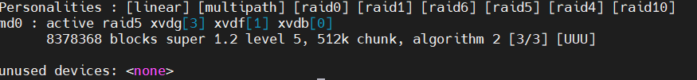

# Project2
## Ashu Patel

## Part 1 - craft a RAID

Craft a RAID that can recover from a minimum of one disk failure.

In `RAID.md` document:

- RAID type choosen
  - RAID 5
- Summary of pros and cons for type chosen
  - Pros: Parity blocks scattered accross drives. And increased write speeds.
  - Cons: Can only handle 1 disk failure.
- Command to build array
  - sudo mdadm --create --verbose /dev/md0 --level=5 --raid-devices=3 /dev/xvdb /dev/xvdg /dev/xvdf

## Part 2 - get info

Verify that your RAID is created and all disks are healthy

In `RAID.md` document:

- command(s) to check RAID status
  - cat /proc/mdstat
- screenshot of what it looks like

- How to read the output of the command(s)
  - Shows raid type and disks inovled in the raid and if the disks are up or not

## Part 3 - mount to directory

Mount your RAID to a logical folder. For example, in class we discussed `/mnt` or creating a `/share` directory

In `RAID.md` document:

- command(s) to create a filesystem and `mount` RAID device to a folder
  - sudo mkfs.ext4 -F /dev/md0
- verifying the RAID device is mounted
  - what commands can prove it
    - df -h -x devtmpfs -x tmpfs 

## Part 4 - break it

Pretend that one of the disks has been behaving oddly, so needs to be replaced. Mark the disk of your choosing as `fail`ing and safely `remove` it from the RAID device configuration.

In `RAID.md` document:

- command to mark a disk as failing
- command to remove failing disk with mdadm
- effect on RAID device

## Part 5 - rebuild it

In `AWS` in the `Volume` management menu, create a new volume (4 GB) and attach it to your instance.

Repair the RAID array using the new device.

In `RAID.md` document:

- command to `add` new device to RAID
- verifying that the RAID device is being rebuilt
  - what commands can prove it
- screenshot result of rebuilt RAID array
