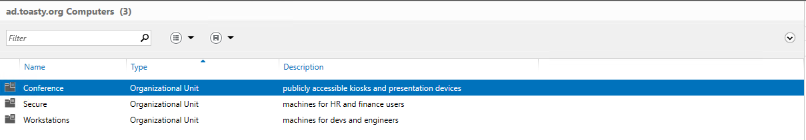
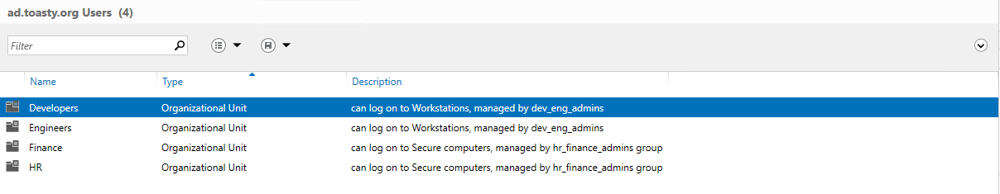
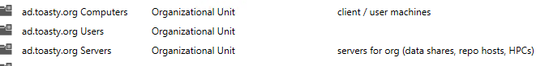
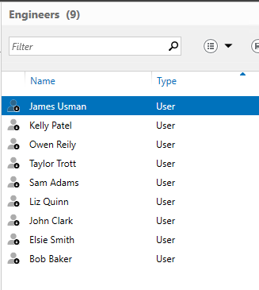
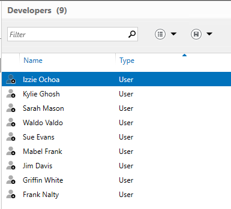
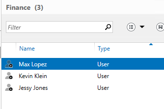
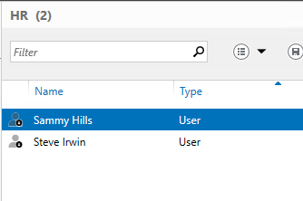

# Project 4

## Setup AD DC
- Configuring a Windows Server to be a Domain Controller
  - Outline of basic steps, resource(s) used
    - Install active directory services 
    - Select role based install
    - Add new forest
    - Keep hitting next
    - Install at end
- Domain Name: ad.toasty.org
- Domain Controller Name: DC 1
- Domain DNS IP: 10.0.0.186

## AD Structure

### Create OUs

- Screenshot proof
  - 
  - 
  - 

### Joining Users

- Screenshot proof of users in correct OUs
  - 
  - 
  - 
  - 

### Joining Computers

- Steps to join a new Windows Server instance to the domain
  - Open control panel
  - System and Security > system
  - Change setting
  - Computer Name click change
  - Enter domain under member ]
  - Restart
- Screenshot proof of success
- Extra Credit: Join Ubuntu Server to domain
  - How
  - Proof

### Creating Groups

- `hr_finance_damins, dev_eng_admins, project_repo_RW` - within ad.toasty.org Users OU
- `server_access` - within ad.toasty.org Servers OU
- `remote_workstation` - within ad.toasty.org Computers > Workstations 

## OUs & GPOs

### Applying Group Policies

- For each GPO, provide:
  - Reference guide to create a Group Policy Object to do as specified
  - Which OU should GPO be applied to
- Lock out Workstations after 15 minutes of inactivity.
  - Computer Config > Policies > Windows Settings > Security Settings > Local Policies > Security Options > Interactive Logon Machine inactivity limit set to 15 
  - Applied in Workstations OU
- Prevent execution of programs on computers in Secure OU
  - Open RUN dialog box > type "regedit" > right click on blank area on the right and new DWORD(32-bit)Value named DisallowRun > open DisallowRun give it value 1 > right click add new key also named DisallowRun > Select DisallowRun on the left pane > right click blank area to right and add new DWORD(32-bit)Value named "1" > open "1" and select application you would like to block
  - Applied in Secure OU 
- Disable Guest account login to computers in Secure OU
  - Group Policy Management > Create new group policy > edit GPO > Access the security options > Access the option named Guest account status > Disable the Guest user account
  - Applied in Secure OU
- Allow server_access to sign on to Servers
  - GPM > create new GPO > Edit > Computer Config > Local Policies > User Right Assignment > Double click Allow log on locally > select server_access group
  - Applied to Secure OU
- Set Desktop background for Conference computers to company logo.
  - GPM > create new GPO > Edit > User Config > Adminstrative Templates > Desktop > Double click Wallpaper > Enable > Set path for image 
- Allow users in `remote_workstation` group to RDP to Workstations
  - GPM > create new GPO > Edit > Computer Config > Windows Settings > Security Settings > Restricted > Click add groups > Click browse type "Remote" > Click ok on Add Group.
  - Applied in Computer OU > Workstations

### Managing OUs 
- How to delagate control of an OU to a group
  - ADUC > Right click on OU > Delegate Control > Select group > Select Tasks to delegate
- Which OUs they now delegate
  - `hr_finance_admins`- control of Finance and HR
  - `eng_dev_admins`- control of Developers and Engineers 
- What permissions they were given (and why you think the scope is appropriate)
  - `hr_finance_admins`- Reset user password and etc, Read all user information 
  - `eng_dev_admins`- Reset user password and etc, Read all user information
  - I chose these common tasks because to create a safe environment where there would be less accidents resulting in someone loosing their data. Also so there is a another human that can verify what is about to be done is correct.